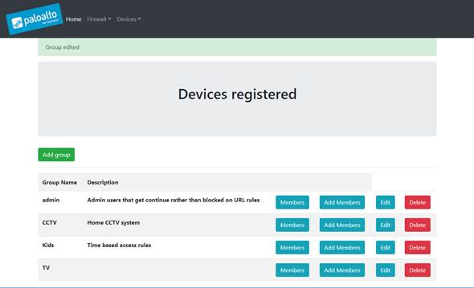

# PaloAltoHomeUserID

Tool for collecting DHCP lease data from the NGFW, and reusing it as part of the user-id.  
Manage and view all settings from a web portal provided.   
 

## Installation

_Installation and configuration instructions are in the [Wiki][wiki]_

## Usage example

_For examples and usage, please refer to the [Wiki][wiki]._

## Support Policy
The code and templates in the repo are released under an as-is, best effort, support policy. These scripts should be seen as community supported and Palo Alto Networks will contribute our expertise as and when possible. We do not provide technical support or help in using or troubleshooting the components of the project through our normal support options such as Palo Alto Networks support teams, or ASC (Authorized Support Centers) partners and backline support options. The underlying product used (the VM-Series firewall) by the scripts or templates are still supported, but the support is only for the product functionality and not for help in deploying or using the template or script itself. Unless explicitly tagged, all projects or work posted in our GitHub repository (at https://github.com/PaloAltoNetworks) or sites other than our official Downloads page on https://support.paloaltonetworks.com are provided under the best effort policy.

<!-- Markdown link & img dfn's -->

[wiki]: https://github.com/tdmakepeace/PaloAltoHomeUserID/wiki

